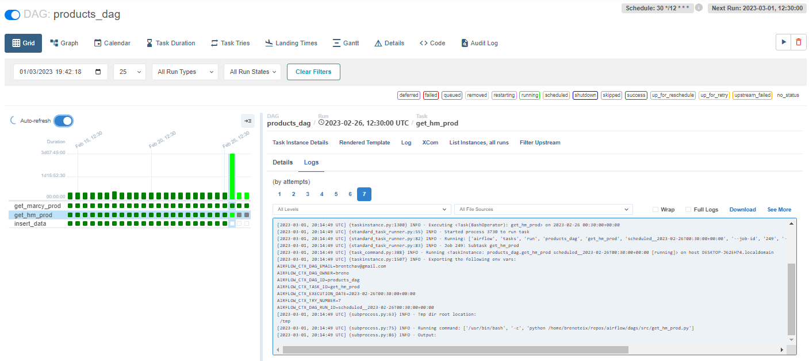
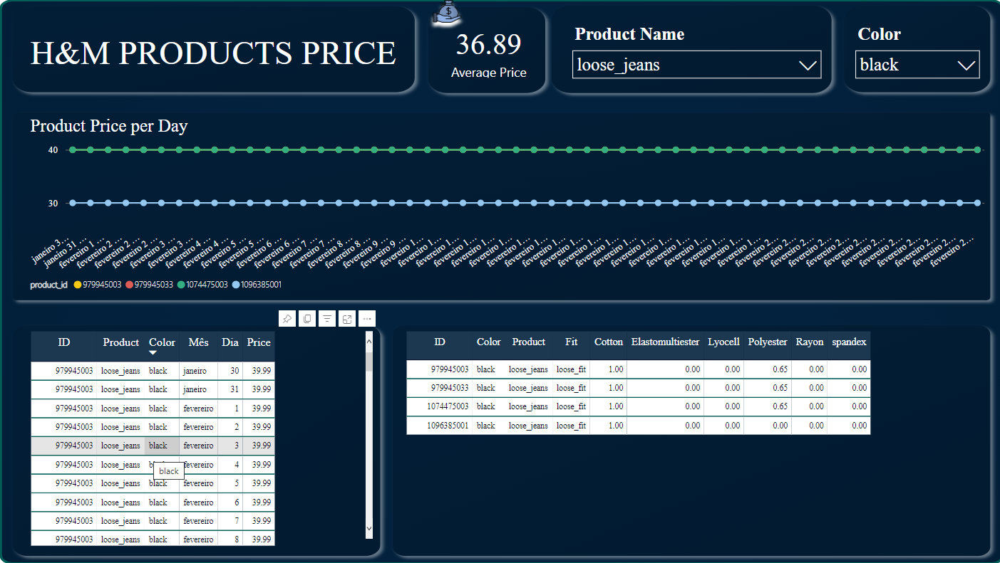
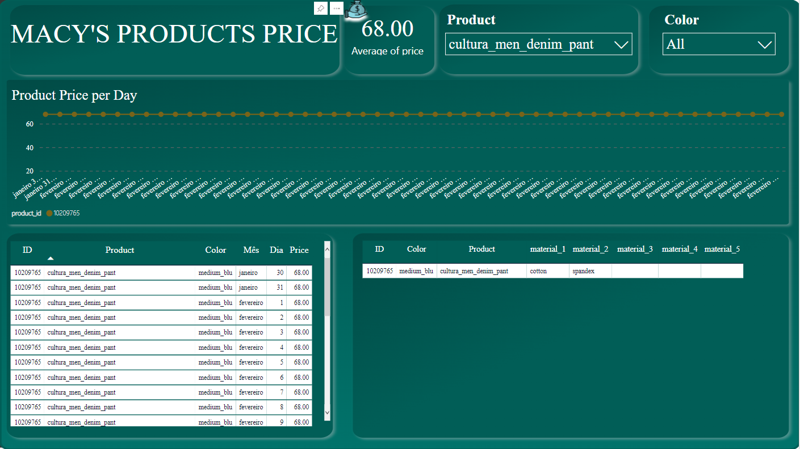

# Star Jeans

Disclaimer: The context of this project is totally fictitious.

# 1.0. Business Problem
Eduardo and Marcelo are two Brazilian business partners. After many successful businesses, they want to move into the fashion market of the United States with an E-commerce business model.

The initial idea is to enter the market with a product for a specific audience, jeans for the male public. The objective is to keep a low operation cost and scale as they acquire more customers.

However, even with the product and audience defined, the partners don't have experience in this market, and they don't know how to define basic things like price, jeans type, and the materials that compose each piece. Thus, the partners hired a Data Analysis Consultancy (me) to help them.

It is known that their main competitors are the American companies H&M and Macy's.

# 2.0. Solution Planning

Collect data from the websites of the main competitors. Extract information like prices, types, colors, compositions, and sizes of the products.

Build a Python script to collect, clean, and save the data in a Postgres Database. Then use a visualization tool (Power BI) to answer the business questions.

Use airflow to automate and orchestrate the whole process.

**Final Product**

The final product will be two dashboards, one for each competitor. In these dashboards, the user will be able to select a product and a period, and it will contain information like average price, daily price, color, and prime materials.

# 2.1. Tools

- SQL and PostgreSQL;
- Python 3.9, Pandas, BeautifulSoup;
- Web scraping;
- ETL Process
- Airflow
- PowerBI

# 3.0. Solution Strategy

- Step 01 Data Extraction
- Step 02 Data Transformation
- Step 03 Loading
- Step 04 ETL Process
- Step 05 Visualization

## 3.1 Data Extraction 

A Python script using BeautifulSoup was designed to scrape the data from H&M and Macy's websites.

## 3.2 Data Transformation

After collecting the data, some data cleaning techniques were necessary to make the data ready for data analysis and visualization.

Using Python, pandas, and regular expressions, some transformations like removing special characters and standardizing the content of the columns were made.

## 3.3 Loading

In this step, the data of each website was inserted in two different tables in a local Postgre database. SQLAlchemy (python library) was used to connect and insert the data in the database.

## 3.4 ETL Process

From the previous section, we ended up with 3 Python scripts:

- script 1: Collect and clean the data from Macy's website.
- script 2: Collect and clean the data from the H&M website.
- script 3: Insert the processed data from the websites in a Postgre Database.

Here, Airflow was used to orchestrate the ETL process. The execution of the tasks was defined as follows:

1. The tasks were scheduled to be executed two times a day for one month.
2. Script 3 would only be executed after scripts 1 and 2.

## 3.5 Visualization

In this step, two dashboards were made — one for Macy's and another for H&M products — using PowerBI desktop and then published on Power BI web. 

To keep the dashboard up to date, it was necessary to connect to the local database with PowerBI web and schedule a daily update of the data. 

## H&M

## Macy's

# 4.0 Results

This solution will allow the partners to monitor the prices of their main competitor's products; this will help them set the prices of their products. Also, they will have information about the prime materials of each type and color of jeans that their competitors offer.

# 5.0 Next Steps

- Use a database in the cloud.
- Run airflow 24/7 in a cloud service.
